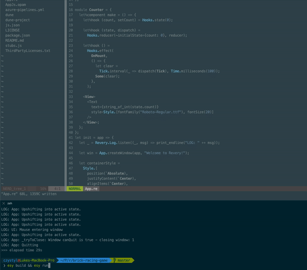

```
Tick.interval(_ => dispatch(Tick), Time.milliseconds(100));
```
Update of the UI is a slower than 100 ms but when I stated using the mouse the timer is going faster, the same is when I'm using the keyboard. 
